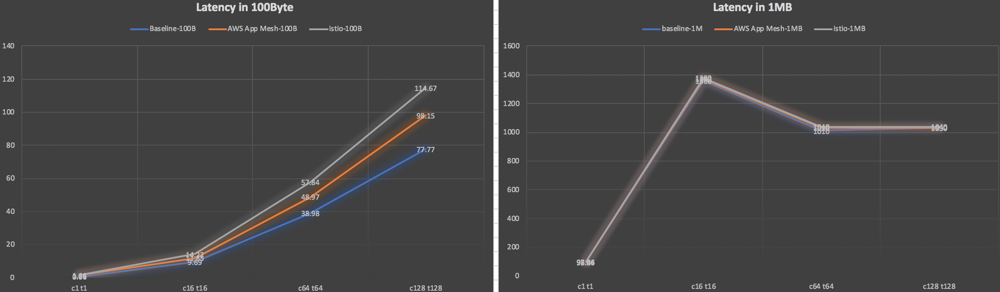
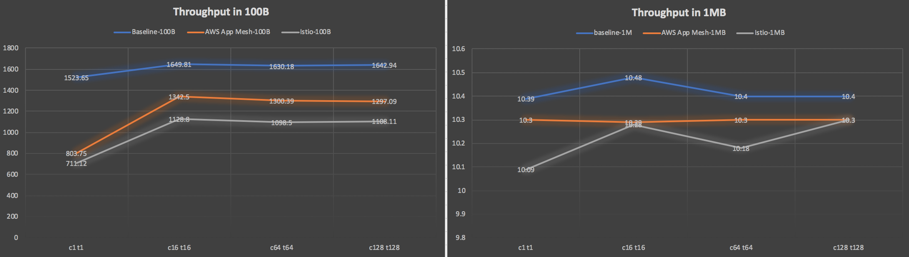
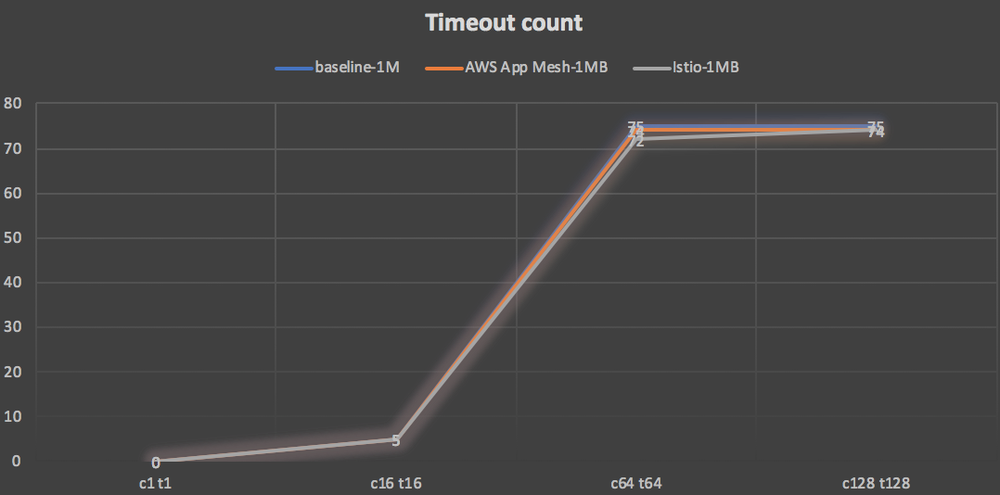
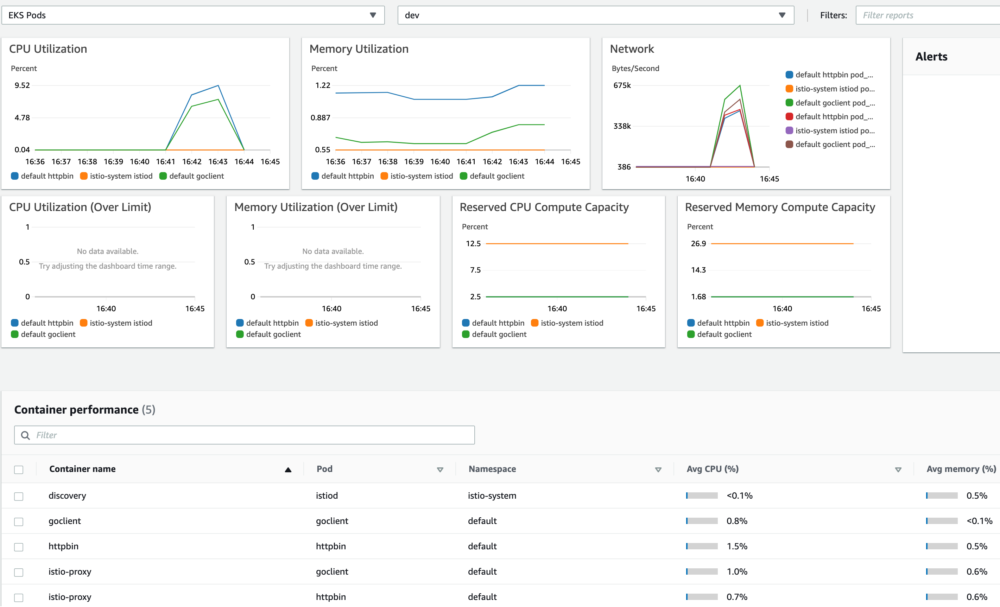
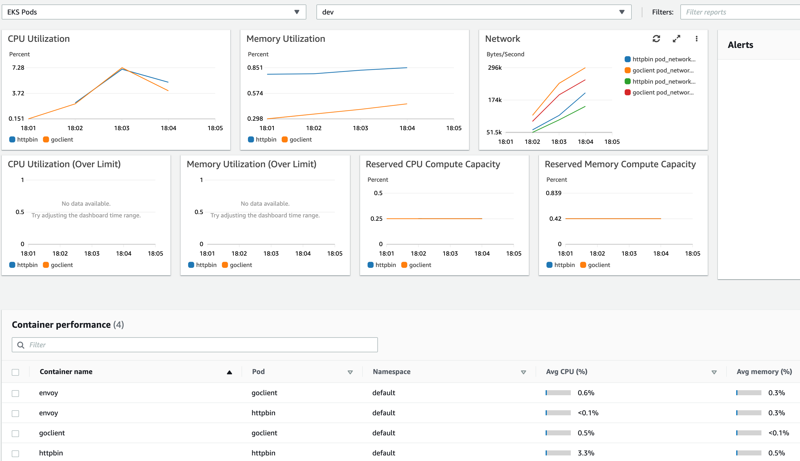
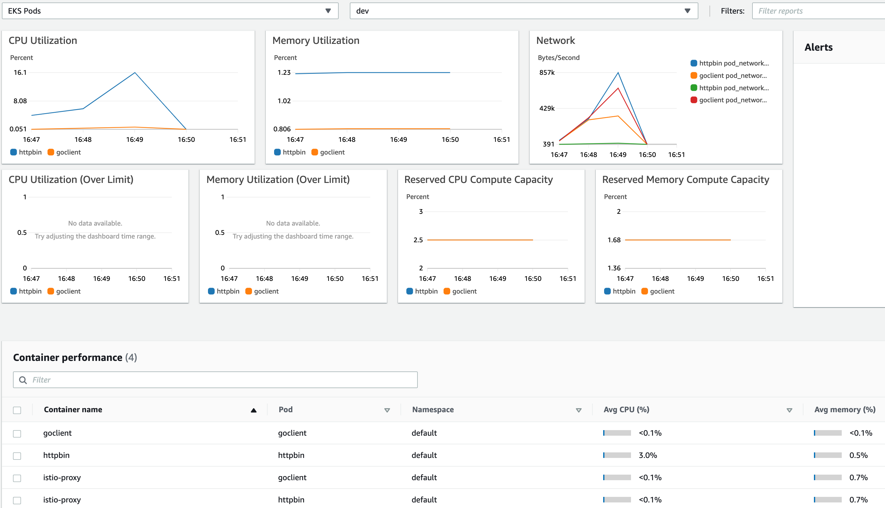
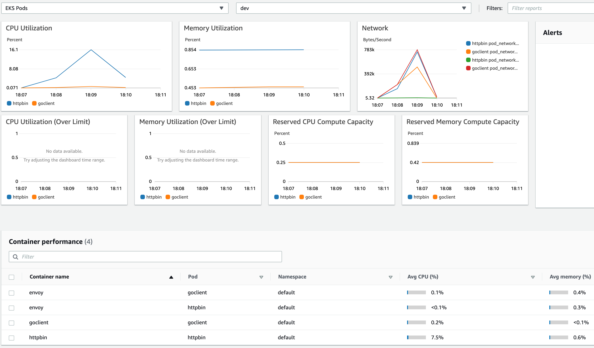
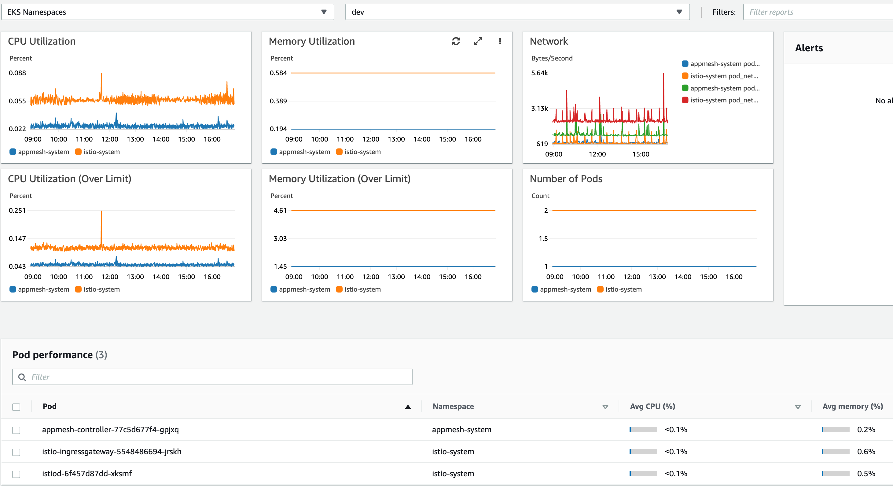

## Benchmark for Istio & AWS App Mesh

### Goals

- Only focus on data plane (Envoy) performance

- Focus on latency, throughput and sytem resouce cost (CPU and memory)

- Investigate how they perform under different data volumes

### Prerequisites

- Environments
  - AWS EKS
    - Kubernetes v1.18, 
    - 1 Node - AL2_x86_64, c5.xlarge(4cpu,8g mem)
  - App Mesh
    - controller v1.1.1
    - Envoy: 840364872350.dkr.ecr.us-west-2.amazonaws.com/aws-appmesh-envoy:v1.15.1.0-prod
  - Istio
    - v1.7.0
    - Envoy: docker.io/istio/proxyv2:1.7.0
  - AWS CloudWatch
  
- Application

  - Client side: HTTP client with Golang v1.15.3, native package

  - Server side: httpbin (docker.io/kennethreitz/httpbin)

  - Test case: 

    - the client as a NodePort service and expose port 8888
    - curl the client on the host with parametes (c1 t1 ~ c128 t128)
    - the client will send a request to call the server's APIs

  - ```
    NAME         TYPE        CLUSTER-IP       EXTERNAL-IP   PORT(S)          AGE
    goclient     NodePort    10.100.180.134   <none>        8888:31952/TCP   28h
    httpbin      ClusterIP   10.100.159.150   <none>        8000/TCP         5d14h
    ```

- Benchmark tool: 

  - wrk 4.1.0-4-g0896020

### Benchmark

#### Latency

- In the small data volumes, App Mesh is a little bit better than Istio.
- In the big data volumes, they are almost the same as baseline.



#### Throughput

- In the small data volumes, App Mesh is a little bit better than Istio.
- In the big data volumes, they are almost the same.



#### Timeout

For big data volumes, the timeout count is almost the same.



#### System resource cost

- Transfer data volumes is 100 Bytes: App Mesh's costs (both cpu & mem) is better than Istio's

  Istio:
  

  App Mesh:
  

- Transfer data volumes is 1 MB: App Mesh's mem cost is better than Istio's; The cpu costs the same as baseline.
  
  Istio:
  

  App Mesh:
  

#### Namespace cost

This is not to say that App Mesh's control plane is better than Istio's. App Mesh has only a Controller under the appmesh-system namespace. Because it's transparent to the user and cannot be sure that its control plane is better than Istiod.



### Conclusion

- For transfering small data volumes, App Mesh is a little better than Istio.
- For transfering big data volumes, they have the same performance.
- App Mesh has a lower system resource cost.

### Further investigation

- Both using Envoy, which part is different that makes the difference?
- Whether the same result for gRPC/TCP or not?
- Investigation with TLS